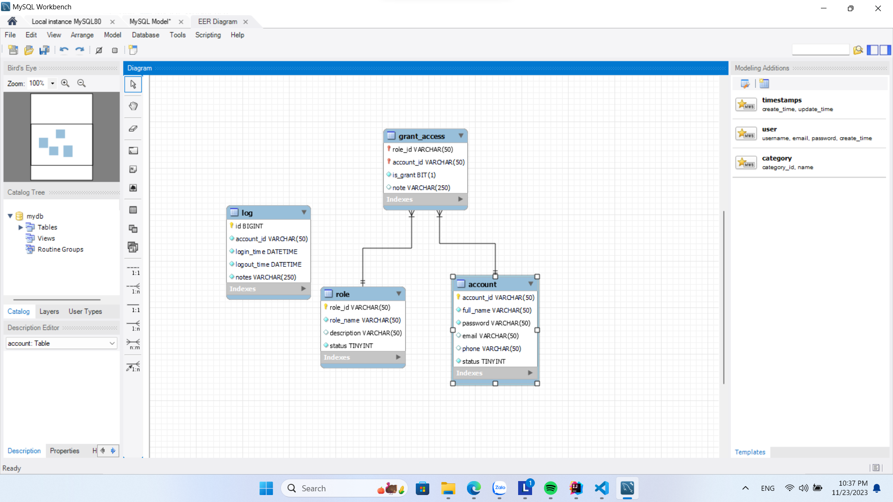
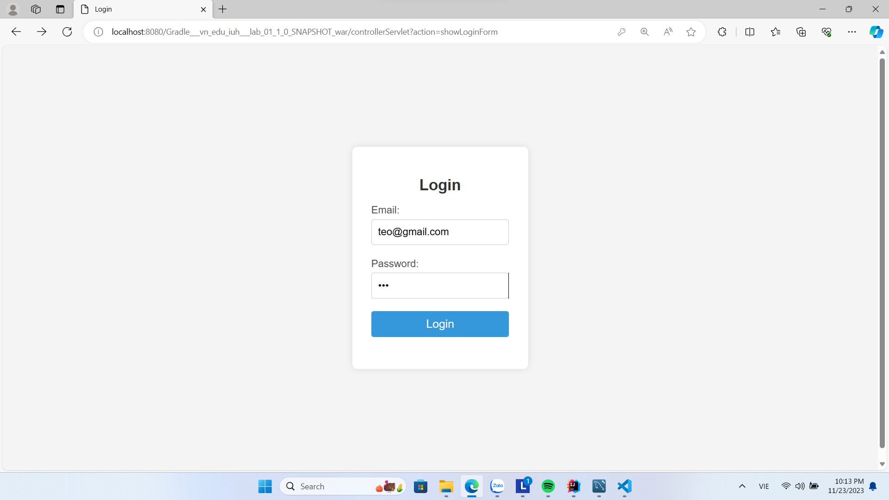
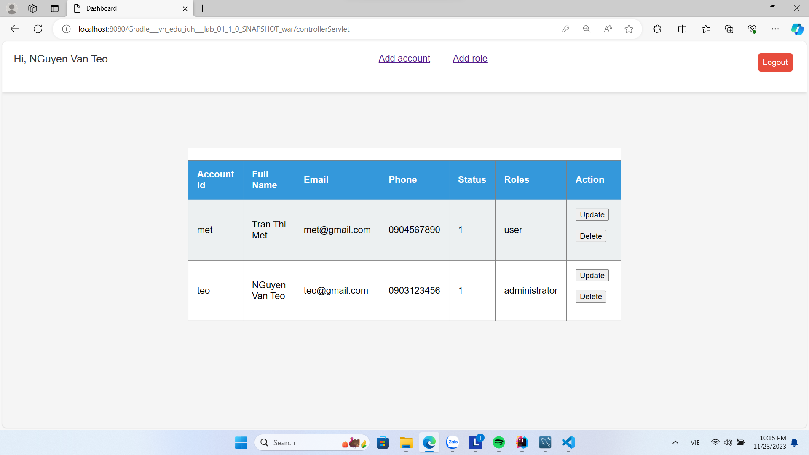
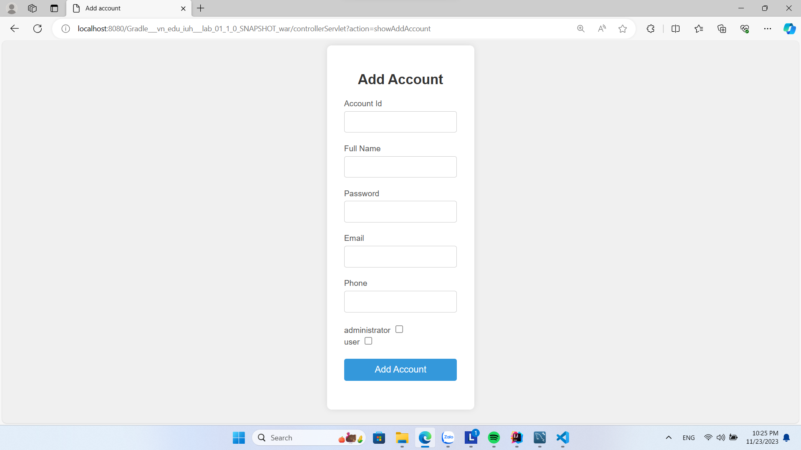
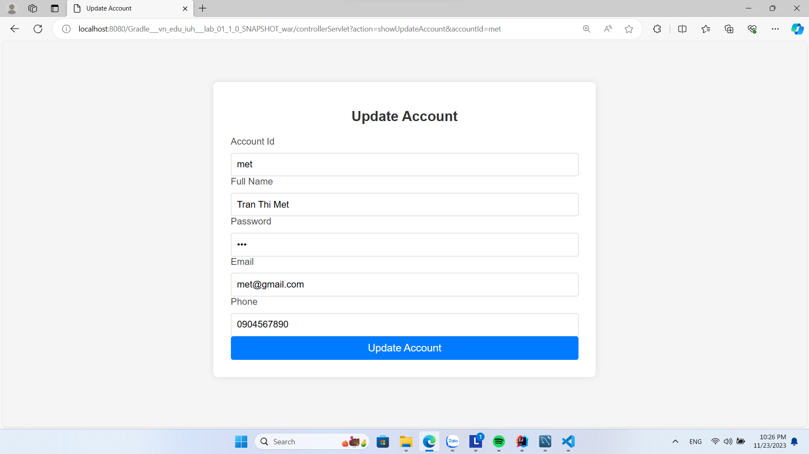
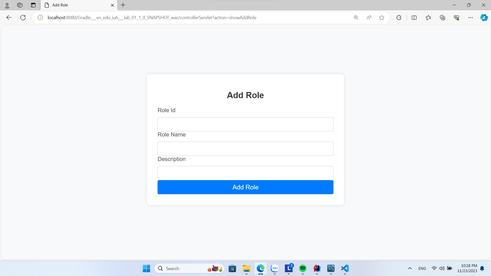
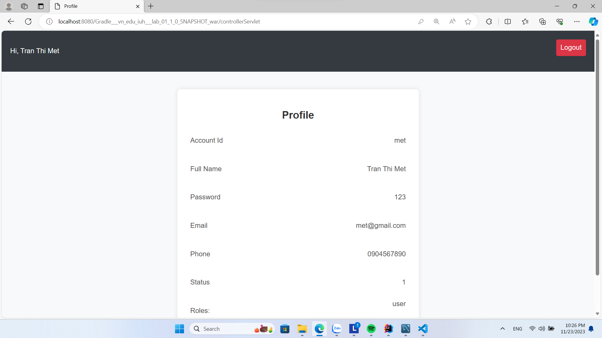

# WWW_java_lab_01

## Description:
Mục tiêu tạo ra một ứng dụng quản lý tài khoản và vai trò sử dụng công nghệ JakartaEE. Bài tập gồm cơ sở dữ liệu với các bảng account, role, grant_access và log để lưu trữ thông tin người dùng và các giao diện để tương tác.

## Features:
- Đăng nhập vào hệ thống
- Thêm, cập nhật, xóa dữ liệu trong bảng account
- Thêm vai trò sử dụng (role)
- Hiển thị thông tin tài khoản người dùng (Nếu là user)
- Hiển thị danh sách tài khoản (Nếu là admin)
- Ghi log khi có đăng nhập, đăng xuất

## Usage guide:
- Sử dụng mariadb hoặc mysql (recommended) làm cơ sở dữ liệu.
- Tải file week01_db_script.sql, mở ứng dụng workbench của sql như HeidiSQL, MysqlWorkbench để thực hiện tạo cơ sở dữ liệu.

## Database diagram:

## Demo:

